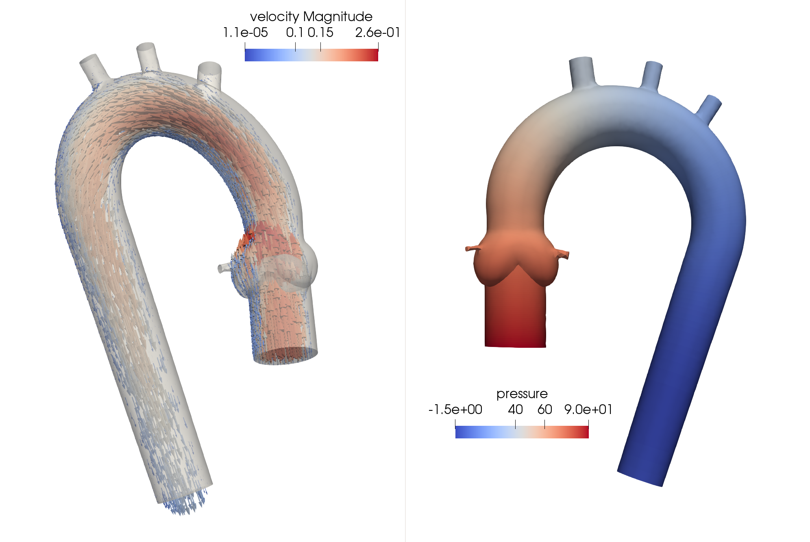
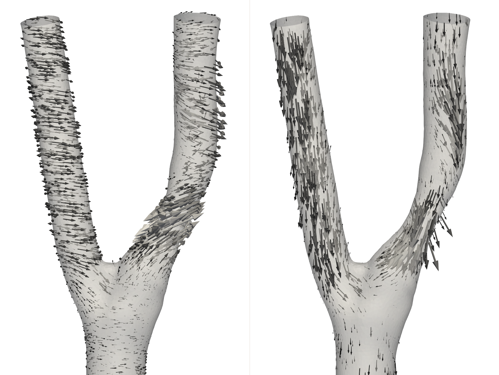
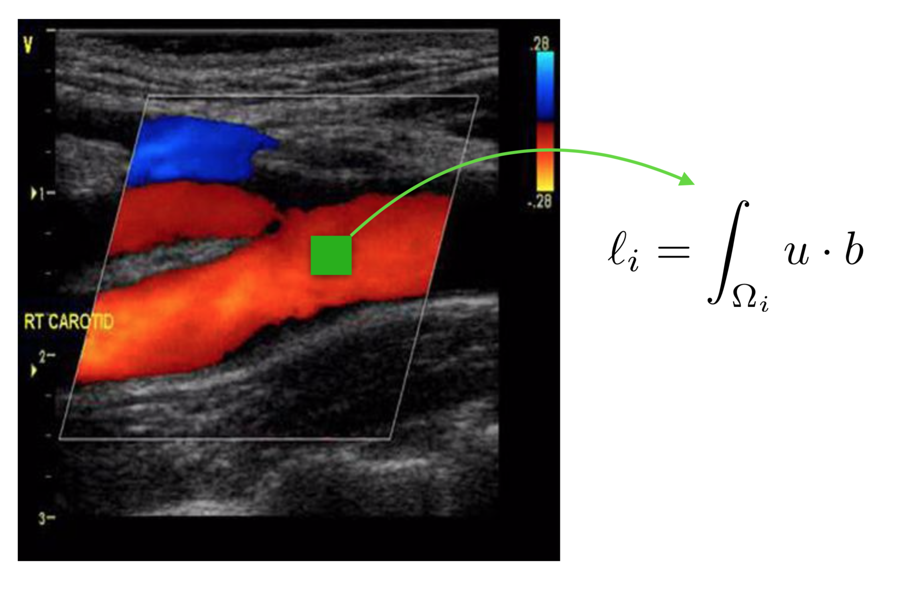
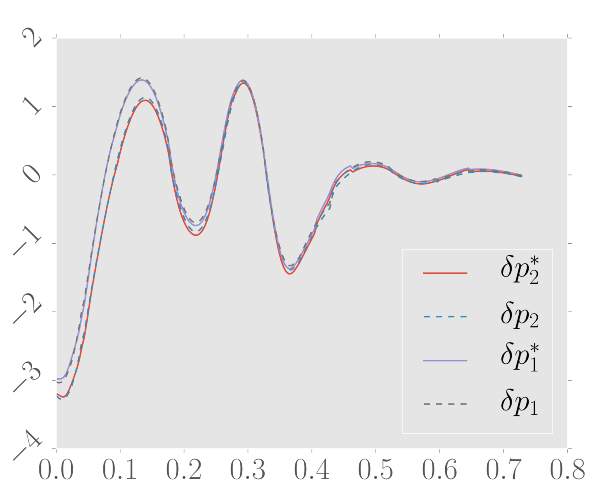

# MAD 
*Multi-physics simulAtions for engineering and Data assimilation*

> MAD is a software for computational mechanics, model reduction and data assimilation, created by Felipe Galarce. This software is developed with the hope to be useful in addressing state-of-the art problems of the field, but more importantly, is a way to ensure reproducibility in science, for any work based on this code.

## Highlights
1. 3D finite element simulations of fluids, solids, heat conduction and waves.
2. Features of CFD implementation on MAD: 
    1. MPI and PETSc are used in the background. The assamblage of discretization matrices and solving of system of equations are done in paralell.
    2. Fractional step schemes such as classical Chorin-Teman or incremental methods.
    3. Possibility of solving monolitich at minimal cost with Brezzi-Pitkaranta P1-P1 stabilised elements.
    4. Customisable time discretization up to BDF2.
    5. 0D Windkessel models coupling.
    6. Customisable time-space dependent boundary conditions.
3. Data assimilation of medical images.
    1. Ultrasound assimilation.
    2. Kalman Filters.
    3. Least-Squares.
    4. PBDW.
4. Easy user-level toolbox of CFD post-processing of fields. 
    1. Gradients.
    2. Wall Shear Stress.
    3. Vorticity.
    4. Pressure Jumps.
    5. Flows.
5. Implementation of inverse problems for the estimation of pressure drops on human blood vessels. Find a survey [here](https://onlinelibrary.wiley.com/doi/abs/10.1002/cnm.2925).
6. Implementation of model reduction techniques for large training data-sets:
    1. Principal component analysis.
    2. Greedy methods.
    3. Data-driven methods.
7. Easy user-level implementation.

## Gallery

**Toy Navier-Stokes simulation on Aorta geometry:**

$`
\begin{aligned}
\rho \left( \partial_t u  + u \cdot \nabla u \right)  - \mu \Delta u + \nabla p = 0 \\
\nabla \cdot u = 0
\end{aligned}
`$

    
**Vorticity and wall shear stress on a common carotid artery:**

**Assimilation of Doppler image and pressure drop estimation:**

 
## Scientific work based on MAD
F. Galarce, K. Tabelow, J. Polzehl, C. Panagiotis, V. Vavourakis, I. Sack, A. Caiazzo. Assimilation of magnetic resonance elastography displacement data in brain tissues. SIAM Journal on Imaging Sciences. 2023. https://arxiv.org/abs/2204.124452022.

F. Galarce, D. Lombardi, O. Mula. State estimation with reduced models andshape variability. Application to biomedical problems., accepted on SIAM Journalon Scientific Computing. Vol 44, Issue 3. 2022. https://arxiv.org/abs/2106.094212021

F. Galarce, D. Lombardi, O. Mula. Reconstructing Haemodynamics Quantitiesof Interest from Doppler Ultrasound Imaging, International Journal for Numerical Methods in Bio-medical Engineering. John Wiley & Sons. Vol 37, Issue 2. 2021. https://arxiv.org/abs/2006.041742020.

F. Galarce, J.-F. Gerbeau, D. Lombardi, O. Mula. Fast Reconstruction of 3D Blood Flows from Doppler Ultrasound Images and Reduced Models, Computer Methods in Applied Mechanics and Engineering. Elsevier. Vol 375. 2021. https://arxiv.org/abs/1904.13367201.

# Installation 

First, select a folder where to install the software. Once there (within a terminal), create a folder to store MAD and its dependencies. Copy and paste the following instructions:    

    mkdir MAD; cd MAD
Now, clone the repository inside the main folder:

    git clone https://gitlab.com/felipe.galarce.m/mad source
And finally, install the dependencies, and compile the main code (in the process, you might be requested to enter your computer password a couple of times):

    cd source; ./install.sh
In adittion, you are encouraged to use Paraview for post-processing tasks. Download [Paraview](https://www.paraview.org/download/)[1]:

# Running a minimal example of a flow past a cylinder
Let us go to the Navier-Stokes solver within MAD:

    cd $MAD_ROOT/projects/pdes/13_navier_stokes_nonlinear/00_fpc/00_fastVonKarman/
Compile the project:    

    make
Run it:

    ./von_karman.exe par
And that's it, you should see how the assembly and time-stepping procces run on your terminal. You can check out the solutions with Paraview with:

    paraview ./results/fluid.case

For a detailed tutorial on what the software is actually doing, please check out the following [tutorial](https://themadprojectpucv.files.wordpress.com/2024/02/mad_flowaroundcyl2d-3.pdf).

## References
[1] James Ahrens Berk Geveci, Charles Law. ParaView: An End-User Tool for Large Data Visualization.

[2] Adrien Loseille, Rémi Feuillet. Vizir: High-order mesh and solution visualization using OpenGL 4.0 graphic pipeline. 2018 - AIAA Aerospace Sciences Meeting, AIAA SciTech Forum, Jan 2018, kissimmee, United States. pp.1-13, ff10.2514/6.2018-1174ff. ffhal-01686714f.

[3] Satish Balay and William D. Gropp and Lois Curfman McInnes and Barry F. Smith. Efficient Management of Parallelism in Object Oriented Numerical Software Libraries. Modern Software Tools in Scientific Computing. 1997.
       
[4] V. Hernandez, J. E. Roman, and V. Vidal. SLEPc: A scalable and flexible toolkit for the solution of eigenvalue problems. ACM Trans. Math. Software, 31(3):351-362, 2005.

[5] Charlier, B. and Feydy, J. and Glaunès, J. A. and Collin, F. and Durif, G. Kernel operations on the {GPU}, with autodiff, without memory overflows. arXiv preprint arXiv:2004.11127. 2020.

[6] F. Galarce, K. Tabelow, J. Polzehl, C. Panagiotis, V. Vavourakis, I. Sack, A. Caiazzo. Assimilation of magnetic resonance elastography displacement data inbrain tissues. SIAM Journal on Imaging Sciences. https://arxiv.org/abs/2204.124452022.

[7] F. Galarce, D. Lombardi, O. Mula. State estimation with reduced models andshape variability. Application to biomedical problems., accepted on SIAM Journalon Scientific Computing. Vol 44, Issue 3. https://arxiv.org/abs/2106.094212021
F. Galarce, D. Lombardi, O. Mula. Reconstructing Haemodynamics Quantities of Interest from Doppler Ultrasound Imaging, International Journal for Numerical Methods in Bio-medical Engineering. John Wiley & Sons. Vol 37, Issue 2. https://arxiv.org/abs/2006.041742020.

[8] F. Galarce, J.-F. Gerbeau, D. Lombardi, O. Mula. Fast Reconstruction of 3D Blood Flows from Doppler Ultrasound Images and Reduced Models, Computer Methods in Applied Mechanics and Engineering. Elsevier. Vol 375. https://arxiv.org/abs/1904.13367201.
